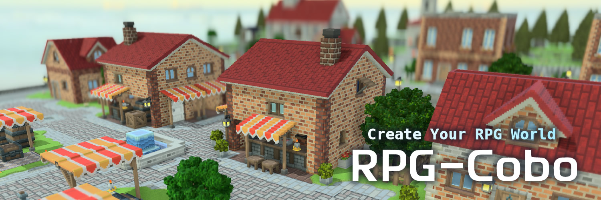

# RPG-Cobo Assets



RPG-Cobo の **デフォルト素材・テンプレート** を管理するリポジトリです。  
マップ用ボクセル、キャラクター、UI、サウンド、サンプルプロジェクトなど、  
RPG-Cobo でゲーム制作を始めるために必要な基本素材が含まれています。

**RPG-Coboを使用するためにこのリポジトリをクローンする必要はありません。**  
以下のリンクよりRPG-Cobo をインストールすると、このリポジトリにある素材がデフォルトで利用できるようになります。

```
https://rpg-cobo.com/download
```

---

## 📦 このリポジトリに含まれるもの

- **ボクセル素材**（地形・建物・オブジェクト）
- **キャラクター素材**（歩行アニメーションなど）
- **UI素材**（ウィンドウ・アイコン）
- **サウンド素材**（SE / BGM）
- **テンプレートプロジェクト**
- **サンプルマップ・サンプルデータ**

---

## 🎮 使い方

このリポジトリは、単体では動作しません。[RPG-Cobo ポータル](https://github.com/djkotori/rpgcobo-portal)アプリから読み込まれ、プロジェクトにコピーされるように出来ています。

ですが、このリポジトリをコピーして独自のアセットライブラリやテンプレートを作成することができます。  
方法については[ドキュメント](https://rpg-cobo.com/guides/start)に今後記載していく予定です。

---

## ✒️ ライセンス
RPG-Cobo は Apache-2.0 License のもとで公開されています。
商用・非商用問わず自由に利用できます。

---

## 🤝 コントリビューション

新しい素材の追加、既存素材の改善、テンプレートの拡充など歓迎します。  
Issue / Pull Request をお送りください。

---

## 📦 リポジトリ構成

RPG-Cobo は複数のリポジトリで構成されています。

- **rpgcobo-tool**  
  ツール本体（エディタ・ゲームランタイム）

- **rpgcobo-portal**  
  プロジェクト管理アプリ（PCにインストールされるアプリ）

- **rpgcobo-web**  
  公式ウェブサイトおよびドキュメント

- **rpgcobo-assets**  
  デフォルト素材・テンプレート

